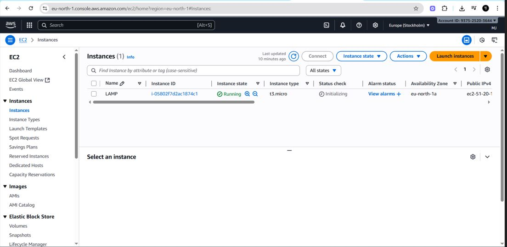
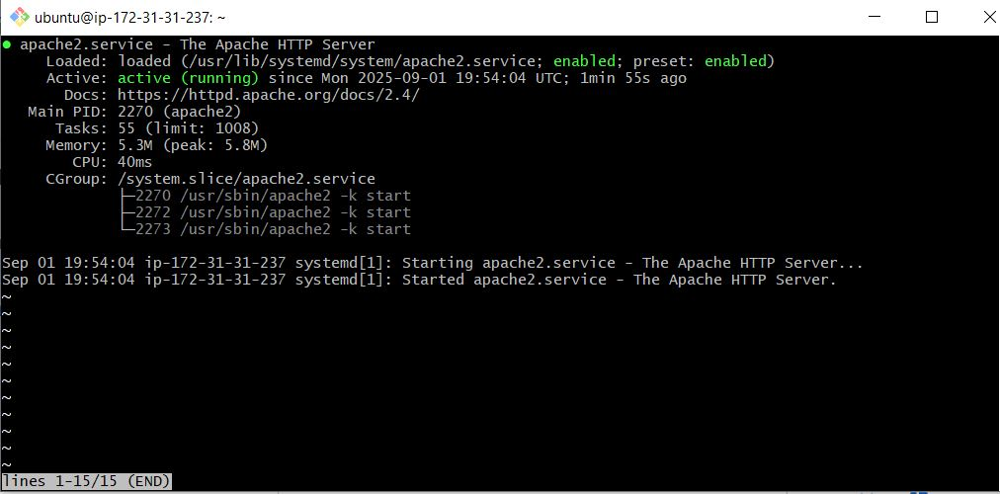
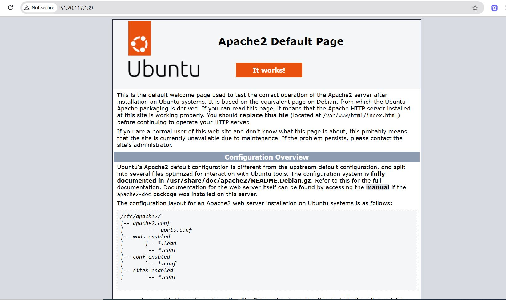

# LAMP STACK ON AWS

## Table of Content
1. [Introduction](#Introduction)
2. [Deploy a LAMP stack manually on AWS](#deploy-a-lamp-stack-manually-on-aws)
    * [Steps 0 - Prepare prerequisites](#steps-0---prepare-prerequisites)
    * [Step 1 - Install Apache and update the firewall](#step-1---install-apache-and-update-the-firewall)
    * [Step 2 - Install MySQL](#step-2---install-mysql)
    * [Step 3 - Install PHP](#step-3---install-php)
    * [Step 4 - Configure Apache Virtual Host](#step-4---configure-apache-virtual-host)
    * [Step 5 - Create PHP script to test the configuration](#step-5---create-php-script-to-test-the-configuration-of-php)
3. [Conclusion](#conclusion)


### Introduction:

The LAMP stack is a very well-known web development platform, it is open source and it is made up of four main components which are: Linux, Apache, MySQL, and PHP (sometimes Perl or Python). This documentation will show you how to setup, configure and use the LAMP stack for your consumption.


## Deploy a LAMP stack manually on AWS

### Steps 0 - Prepare prerequisites

- Spin up an Ubuntu OS EC2 instance on AWS

If successful, The console should display your EC2 instance running like this:



- Change permissions for the private key file:

```sh
sudo chmod 0400 <private-key-name>.pem
```

- Connect to the ubuntu instance by running :

```sh
ssh -i <private-key-name>.pem ubuntu@<publi-ip-address>
```


### Step 1 - Install Apache and update the firewall
Apache is the web server that serves our web content to the end user.

- Update the package list and install Apache

```sh
# Update package list
sudo apt update -y
sudo apt upgrade -y

# Install Apache web server
sudo apt install apache2 -y

```

- Start and enable the apache2 service and verify that Apache is running:

```
sudo systemctl start apache2
```
```
sudo systemctl enable apache2
```
```
sudo systemctl status apache2
```




- Access Apache locally with curl:

```sh
curl http://localhost:80

```
Alternatively, you can access it using the IP address of the ec2




### Step 2 - Install MySQL
To be able store and manage data for our web application in a relational database, we will install MYSQL.

- Install mysql with apt

```sh
sudo apt install mysql-server -y
```
- Login to the MYSQL console by typing:
```sh
sudo mysql
```
This will connect mysql and the administrative database user root

Following best practice, it is recommended to run a security script that comes pre-installed with MYSQL to remove some insecure default settings and lock down access to the database system. Before we do this, we will set a password for the *root* user. For simplicity, we will use `password123@`. We will be using `mysql_native_password` as the default authentication method:
- Set MYSQL root user password:

```
ALTER USER 'root'@'localhost' IDENTIFIED BY 'password123@';
```
- Secure mysql installation by starting the interactive script:

```sh
sudo mysql_secure_installation
```

Follow and answer the questions as preferred


- Test if you are able to login to the MYSQL shell as root user using the set password:

```sh
sudo mysql -u root -p
```
if successful, you should be able to login. You can exit the MySQL monitor by entering `exit`


### Step 3 - Install PHP
Now we install PHP to process code and to display dynamic content to the end user. We will install the `php` package, `php-mysql` which is a php module that php uses to communicate with MYSQL-based database; and `libapache2-mod-php` which enables Apache to handle PHP files.

- Run the following command to install the 3 necessary packages:

```sh
sudo apt install php libapache2-mod-php php-mysql
```
Core PHP packages will be automatically installed as dependencies.

We can also optionally install other php modules:

```sh
sudo apt install php-cli php-curl php-gd php-mbstring php-xml php-xmlrpc php-zip -y

```

- Verify PHP installation by checking the version:
```sh
php --version
```
if php has been successfully installed, you will get an image similar to the one below:


Our LAMP is now succesfully installed and ready to be used. We will test our set up with as PHP script. We will follow best practice by setting up an Apache Virtual Host to hold our website files and folders. A virtual host allows us to serve multiple websites on one single host machine.


### Step 4 - Configure Apache Virtual Host

We will create a directory next to the default one at `/var/www/html`

- Create a directory named `lampstack` as follows:

```sh
sudo mkdir /var/www/html/lampstack
```
- Next, we will set the correct permissions:

```
sudo chown -R $USER:$USER /var/www/html/lampstack

```

- Create a new configuration file in apache's `sites-available` directory.

```
sudo vi /etc/apache2/sites-available/lampstack.conf
```

Add the following to the configuration file:

```
<VirtualHost *:80>
    ServerName [your_project_name or domain_address]
    ServerAlias [www.your_project_name or www.yourdomain.com]
    ServerAdmin webmaster@localhost
    DocumentRoot /var/www/[your_project_name]
    ErrorLog ${APACHE_LOG_DIR}/error.log
    CustomLog ${APACHE_LOG_DIR}/access.log combined
</VirtualHost>
```

The virtualhost configuration gives a directive to apache to serve `lampstack` using `/var/www/html/lampstack` as the web root directory.


- Enable the new virtual host:
```sh
sudo a2ensite lampstack.conf 
```

### Step 6 - Create PHP script to test the configuration

- Add the php info file `info.php` under `/var/www/html/lampstack` to run a script that display the php version webpage.

```sh
<?php
phpinfo();
?>
```

- Reload Apache to ensure that the changes take effect:

```
sudo systemctl reload apache2
```
- Access your web browser to display the changes

https://(ec2_ip_address)/lampstack/info.php


## Conclusion
We successfully deployed a LAMP stack on AWS Cloud!
