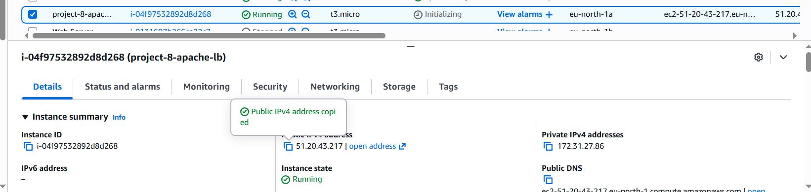
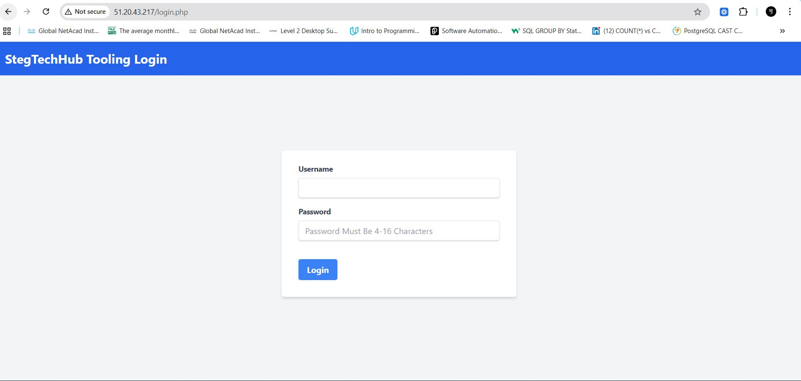
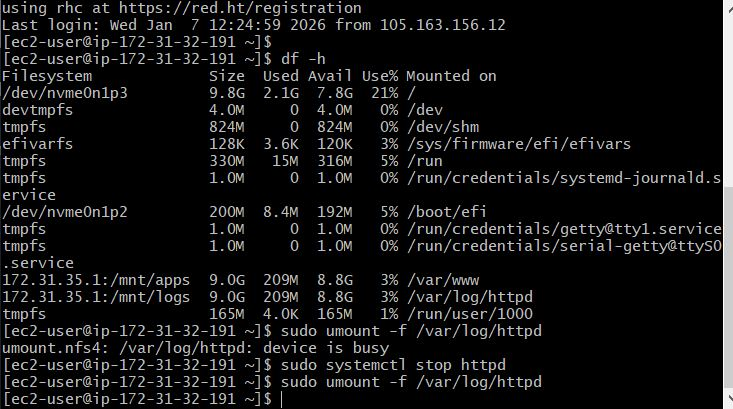
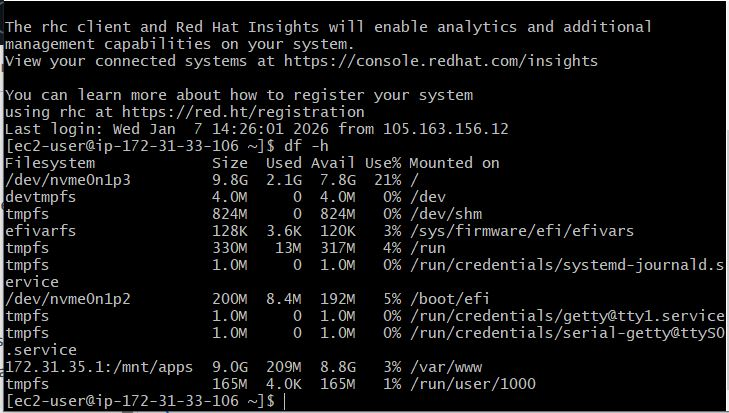
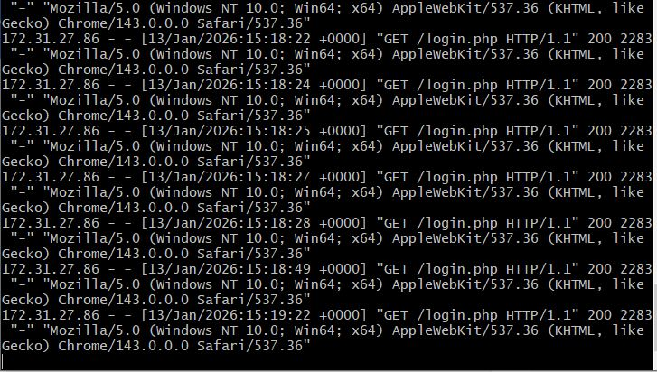
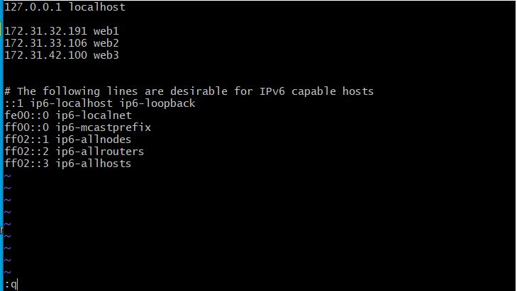
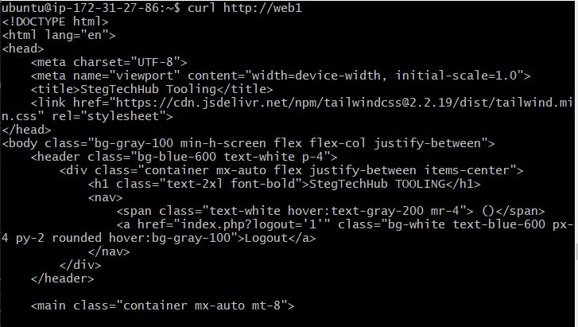
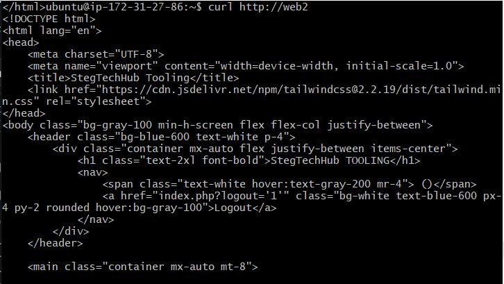
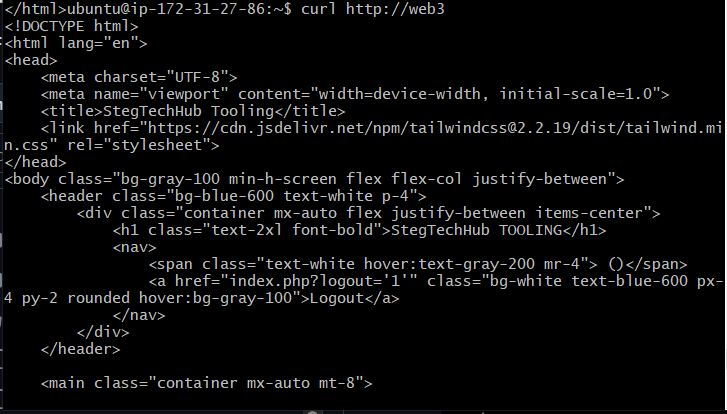

# Implementing an Apache Load Balancer Solution for a Web Application

In the world of web applications, ensuring smooth performance and high availability is crucial. One effective way to achieve this is through load balancing. This guide will walk you through the process of deploying and configuring an Apache Load Balancer for a Tooling Website solution.

## Project Overview

Our goal is to set up an Apache Load Balancer on a separate Ubuntu EC2 instance. This configuration will distribute client requests among underlying web servers, optimizing the load distribution and ensuring users can access the web servers through the load balancer.

## Prerequisites

Before we begin, make sure you have the following components ready (project 7):

- Three RHEL9 Web Servers
- One MySQL DB Server (Ubuntu 24.04)
- One RHEL9 NFS Server

Additionally, confirm these configurations:

- Apache (httpd) is operational on both Web Servers
- `/var/www` directories of both Web Servers are mounted to `/mnt/apps` on the NFS Server
- All necessary TCP/UDP ports are open on Web, DB, and NFS Servers
- Client browsers can access both Web Servers via their Public IP addresses or Public DNS names and can open the Tooling Website (e.g., `http://<Public-IP-Address-or-Public-DNS-Name>/index.php`)

## Step 1: Configuring Apache as a Load Balancer

### 1.1 Create an EC2 Instance

Start by launching an Ubuntu Server 24.04 EC2 instance. Name it "Project-8-apache-lb" for easy identification.



### 1.2 Configure Security Group

Open TCP port 80 on your new instance by creating an Inbound Rule in the Security Group.

### 1.3 Install and Configure Apache Load Balancer

Now, let's set up Apache to distribute traffic between our web servers.

#### i. Install Apache2

Access your instance and update and upgrade Ubuntu:

```bash
sudo apt update && sudo apt upgrade
```

Install Apache and its dependencies:

```bash
sudo apt install apache2 -y
sudo apt-get install libxml2-dev
```

#### ii. Enable Required Modules

Apache needs specific modules to function as a load balancer. Enable them with these commands:

```bash
sudo a2enmod rewrite
sudo a2enmod proxy
sudo a2enmod proxy_balancer
sudo a2enmod proxy_http
sudo a2enmod headers
sudo a2enmod lbmethod_bytraffic
```

#### iii. Restart Apache2 Service

After enabling the modules, restart Apache to apply the changes:

```bash
sudo systemctl restart apache2
sudo systemctl status apache2
```

### 1.4 Configure Load Balancing

Edit the Apache configuration file:

```bash
sudo vi /etc/apache2/sites-available/000-default.conf
```

Add the following configuration within the `<VirtualHost *:80>  </VirtualHost>` section:

```apache
<Proxy "balancer://mycluster">
    BalancerMember http://172.31.32.191:80 loadfactor=5 timeout=1
    BalancerMember http://172.31.33.106:80 loadfactor=5 timeout=1
    BalancerMember http://172.31.42.100:80 loadfactor=5 timeout=1
    ProxySet lbmethod=bytraffic
    # ProxySet lbmethod=byrequests
</Proxy>

ProxyPreserveHost on
ProxyPass / balancer://mycluster/
ProxyPassReverse / balancer://mycluster/
```

This configuration uses the `bytraffic` balancing method, which distributes incoming load between the Web Servers based on current traffic load. The `loadfactor` parameter controls the proportion of traffic distribution.


Restart Apache to apply the changes:

```bash
sudo systemctl restart apache2
```

## Step 2: Verifying the Configuration

### 2.1 Access the Website

Try accessing the website using the Load Balancer's Public IP address or Public DNS name from a browser.



### 2.2 Unmount NFS Directory (if necessary)

If `/var/log/httpd` was previously mounted from the Web Server to the NFS Server, unmount it to ensure each Web Server has its own log directory.

Check if the Web Server's log directory is mounted to NSF

```bash
df -h
sudo umount -f /var/log/httpd
```
If the directory is busy, the services using it needs to be stopped first.
```bash
sudo systemctl stop httpd
```

Verify that the directory is unmounted on all servers
```bash
df -h
```





### 2.3 Monitor Web Server Logs

Open two SSH consoles, one for each Web Server, and run:

```bash
sudo tail -f /var/log/httpd/access_log
```
Web Server 1 ```access_log```


Web Server 2 ```access_log```


Refresh the browser page several times. You should see new records appear in each web server's log files. The number of requests to each server should be approximately the same since we set the `loadfactor` to the same value for both servers.

## Optional Step: Configuring Local DNS Names Resolution

To simplify server management, we can configure local domain name resolution using the `/etc/hosts` file.

### Configure IP Address to Domain Name Mapping

Edit the hosts file:

```bash
sudo vi /etc/hosts
```


Add three records with Local IP addresses and arbitrary names for the Web Servers:

```
<WebServer1-Private-IP-Address> Web1
<WebServer2-Private-IP-Address> Web2
<WebServer3-Private-IP-Address> Web3
```

Update the Load Balancer config file with these names:

```bash
sudo vi /etc/apache2/sites-available/000-default.conf
```

Replace the IP addresses with the arbitrary names:

```apache
BalancerMember http://Web1:80 loadfactor=5 timeout=1
BalancerMember http://Web2:80 loadfactor=5 timeout=1
BalancerMember http://Web3:80 loadfactor=5 timeout=1
```

Test the configuration by curling the Web Servers from the Load Balancer:

```bash
curl http://Web1
```


```bash
curl http://Web2
```


```bash
curl http://Web3
```


If havig error with curl, ensure to restart the httpd service in each webserver.

Remember, this configuration is local to the Load Balancer server and won't be resolvable from other servers or the internet.

## Conclusion

The `mod_proxy_balancer` module in Apache HTTP Server offers robust features for load balancing, including support for sticky sessions, health checks, and various load balancing algorithms. By properly configuring these options, we ensure high availability, scalability, and reliability for our web application.

This setup provides a solid foundation for managing traffic across multiple web servers, improving the overall performance and reliability of your web application.

---
