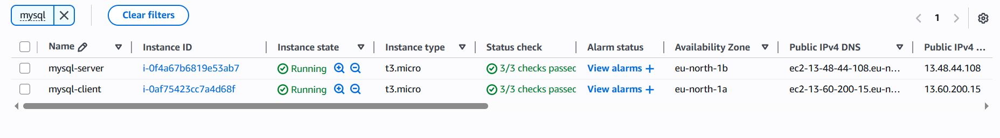
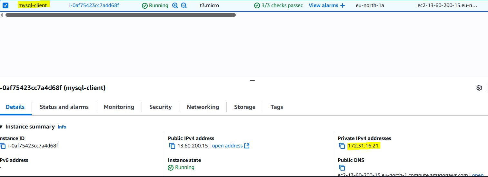
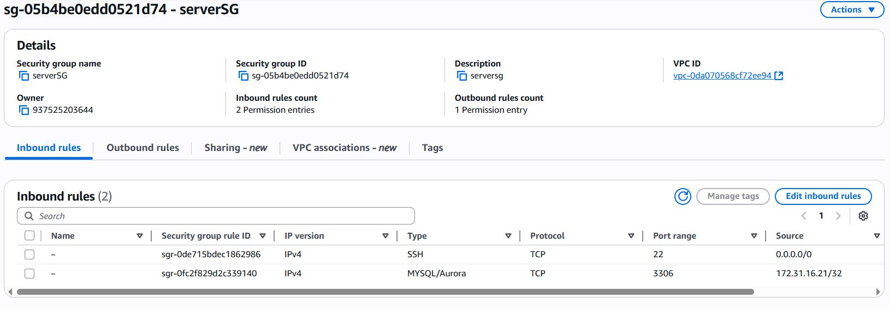
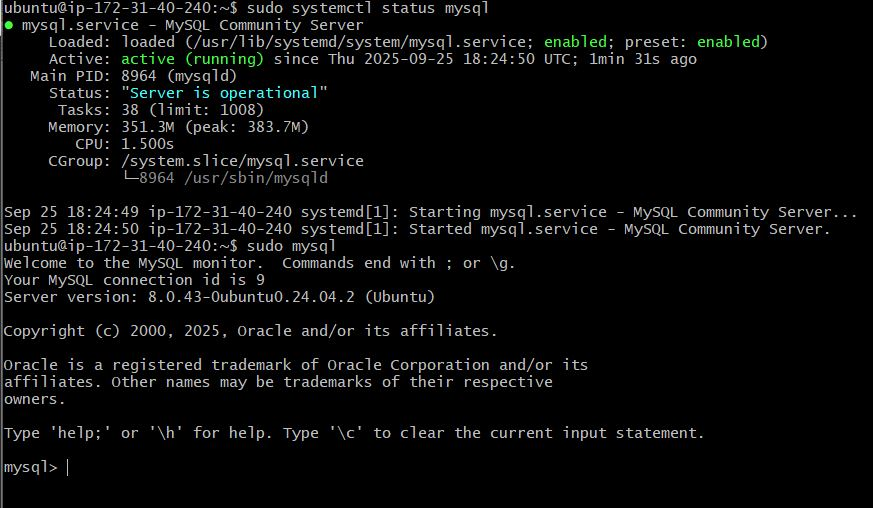
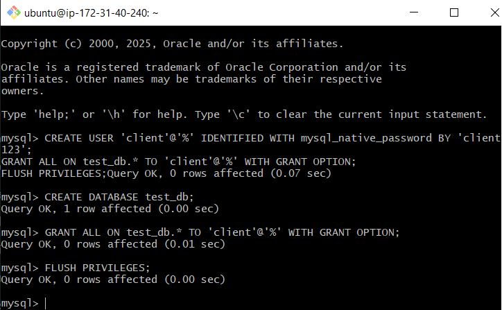
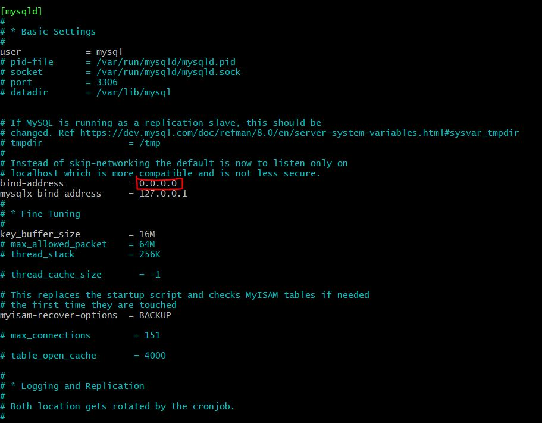
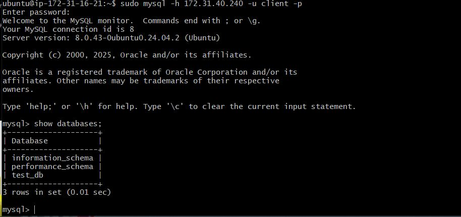
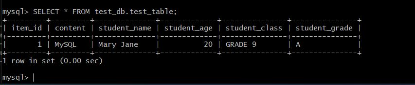
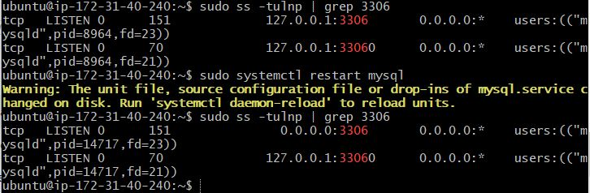

# CLIENT-SERVER ACHITECTURE WITH MYSQL

## Overview:
In a client-server architecture, the client requests data or services, and the server responds with the requested information. For a MySQL-based architecture, the client would communicate with a MySQL server, where the database operations such as queries, inserts, updates, and deletions occur.

**Architecture Components:**
- Client:
Could be a web app (browser), desktop app, mobile app, or backend API.
Sends requests (e.g., HTTP or direct DB queries) to the server for data.

- Server:
Contains the business logic (usually a backend server, such as Node.js, FastAPI, or a PHP server).
Interacts with the MySQL database to retrieve or modify data.
Sends the response back to the client.

- MySQL Database:
Stores the data.
Responds to queries from the server to fetch or update data.


## Let's Get Started!

### Step 1: Create and Configure two Linux-based Virtual Machines

First, we need to create two virtual computers in the cloud. We will call one the "MySQL Server" and the other the "MySQL Client".

1. We will use Amazon's EC2 service to create these virtual computers:

   

2. We will now take note of the MySQL Client server private IP and update the security rules in the MySQL Server:

   

   


### Step 2: Setting Up Our MySQL Server

Now, let's set up the machine environment (our MySQL Server):

1. After creatiing the ec2 instance and doing all the preliminaries stated earlier, we will now connect to our server using a special key:


2. Let's make sure our ec2 environment has all the latest packages referenced correctly:

   ```bash
   sudo apt update && sudo apt upgrade -y
   ```

3. Time to install MySQL Server – this is the service that we would like to access from the client machine which we would be setting up soon.

   ```bash
   sudo apt install mysql-server -y
   ```

4. We'll make sure MySQL starts up every time we open our ec2 machine:

   ```bash
   sudo systemctl enable mysql && sudo systemctl start mysql
   ```
   

### Step 3: Setting Up Our MySQL Client

Now for the supposed user that would be connecting and requesting access to the mysql server (our MySQL Client):

1. Let's connect to our client machine:

2. Update everything, just like we did for the server:

   ```bash
   sudo apt update && sudo apt upgrade -y
   ```

3. Install MySQL Client – this action arms our client machine with the ability to connect, make requests and perform sql-like operations on our mysql-server instance/database:

   ```bash
   sudo apt install mysql-client -y
   ```

### Step 4: Connect to MySQL Server via MySQL Client.

Now, we need to ensure our server (MySQL Server) can connect to the client (MySQL Client) to and if necessary, perfom some operation. We can do this by changing some security settings:

Let's set up our server to accept the connection:

1. Firstly, we will run a security script to make sure our server's configurations is safe and secure:

   ```bash
   sudo mysql_secure_installation
   ```
   Proceed with the prompts to set up the mysql-server with the security settings that pleases you.
2. Now, let us go inside our MySQL server:

   ```bash
   sudo mysql
   ```

3. We will now create a user for our client and a database as well:

   ```sql
   CREATE USER 'client'@'%' IDENTIFIED WITH mysql_native_password BY 'client123';
   CREATE DATABASE test_db;
   GRANT ALL ON test_db.* TO 'client'@'%' WITH GRANT OPTION;
   FLUSH PRIVILEGES;
   ```
   

4. Let us tell our server to listen for visitors and attend to them:

   ```bash
   sudo vim /etc/mysql/mysql.conf.d/mysqld.cnf
   ```
   Change `bind-address = 127.0.0.1` to `bind-address = 0.0.0.0`

   
 

5. Now, from our MySQL Client, let us access the MySQL Server:

```bash
sudo mysql -u client -h 172.31.40.240 -p
```


6. Let us now make sure we can actually make changes in the server from our client:

   ```sql
   show databases;
   ```

   ```sql
   CREATE TABLE test_db.test_table (
     item_id INT AUTO_INCREMENT,
     content VARCHAR(255),
     student_name VARCHAR(255),
     student_age INT,
     student_class VARCHAR(255),
     student_grade VARCHAR(255),
     PRIMARY KEY(item_id)
   );
   ```
   
   ```sql
   INSERT INTO test_db.test_table (content, student_name, student_age, student_class, student_grade) 
   VALUES ("MySQL", "Mary Jane", "20", "GRADE 9", "A"); 
   ```

   ```sql
   SELECT * FROM test_db.test_table;
   ```
   

### Challenges Faced:

When connecting the client to the server,I faced a Can't connect to MySQL server on '172.31.40.240:3306' (111) error. After researching, I learnt that The (111) is a "connection refused" error meaning the network path exists, but the server is not accepting connections.

 

I began my troubleshooting by checking in the server if MySQL is bound correctly and noticed it was still reading 127.0.0.1 instead of 0.0.0.0. Considering I had updated the /etc/mysql/mysql.conf.d/mysqld.cnf, I restarted the mysql service.

```bash
 sudo ss -tulnp | grep 3306'
 ```

```bash 
 sudo systemctl restart mysql'
 ```


## Conclusion
You have just built a fully functional MySQL Client-Server setup. This project has delivered it's aim of helping you understand how to setup a server database (mysql in our case) and setup a client to access and perform operations on the server db.

