# DevOps Tooling Website Solution

## Introduction

This project implements a solution comprising the following components:

- Infrastructure: AWS
- Web Server Linux: Red Hat Enterprise Linux 9
- Database Server: Ubuntu Linux + MySQL
- Storage Server: Red Hat Enterprise Linux 9 + NFS Server
- Programming Language: PHP
- Code Repository: GitHub

The diagram below illustrates the architecture of the solution.

## Step 1 - Preparing the NFS Server

### 1. First, Spin up an EC2 instance with RHEL Operating System


### 2. Configure Logical Volume Management on the Server

We will format the LVM as XFS and create three Logical Volumes: lv-opt, lv-apps, and lv-logs. Then, we'll create mount points on the /mnt directory for these logical volumes:

- Mount lv-apps on /mnt/apps - To be used by web servers
- Mount lv-logs on /mnt/logs - To be used by web server logs
- Mount lv-opt on /mnt/opt - To be used by Jenkins server in the next project

#### Create and Attach Volumes

First, let's create 3 volumes in the same Availability Zone as the NFS Server EC2, each of 10GB, and attach them one by one to the NFS Server.


#### Configure the Server

Now, let's access the Linux terminal to begin configuration:

Use `lsblk` to inspect the block devices attached to the server:

```bash
lsblk
```


My new devices are named nvme1n1, nvme2n1, and nvme3n1 because in my case I used t3.micro instance type

#### Create Partitions

We'll use the `parted` utility to create a single partition on each of the 3 disks:

```bash
sudo parted /dev/nvme1n1 --script mklabel gpt mkpart primary xfs 0% 100%
sudo parted /dev/nvme2n1 --script mklabel gpt mkpart primary xfs 0% 100%
sudo parted /dev/nvme3n1 --script mklabel gpt mkpart primary xfs 0% 100%
```


Now, let's view the newly configured partitions:

```bash
lsblk
```


#### Install LVM2

Install the `lvm2` package:

```bash
sudo yum install lvm2 -y
```

#### Create Physical Volumes

Use the `pvcreate` utility to mark each of the 3 disks as physical volumes (PVs) to be used by LVM:

```bash
sudo pvcreate /dev/nvme1n1p1 /dev/nvme2n1p1 /dev/nvme3n1p1
sudo pvs
```


#### Create Volume Group

Use the `vgcreate` utility to add all 3 PVs to a volume group (VG). We'll name the VG `webdata-vg`:

```bash
sudo vgcreate webdata-vg /dev/nvme1n1p1 /dev/nvme2n1p1 /dev/nvme3n1p1
sudo vgs
```

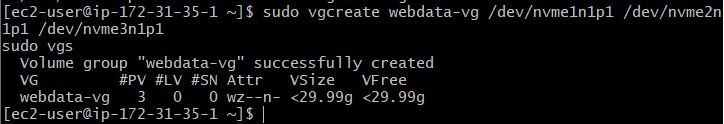

#### Create Logical Volumes

Now, let's use the `lvcreate` utility to create 3 logical volumes: `lv-apps`, `lv-logs`, and `lv-opt`:

```bash
sudo lvcreate -n lv-apps -L 9G webdata-vg
sudo lvcreate -n lv-logs -L 9G webdata-vg
sudo lvcreate -n lv-opt -L 9G webdata-vg

sudo lvs
```

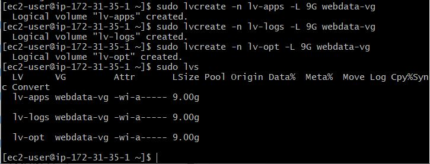

#### Verify the Setup

To view the complete setup of VG, PV, and LV:

```bash
sudo vgdisplay -v
lsblk
```

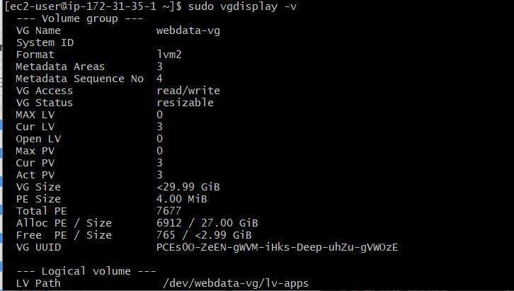

#### Format Logical Volumes

We'll use `mkfs.xfs` to format the logical volumes with XFS filesystem:

```bash
sudo mkfs.xfs /dev/webdata-vg/lv-apps
sudo mkfs.xfs /dev/webdata-vg/lv-logs
sudo mkfs.xfs /dev/webdata-vg/lv-opt
```


#### Create Mount Points

Create mount points on the `/mnt` directory:

```bash
sudo mkdir -p /mnt/{apps,logs,opt}
sudo mount /dev/webdata-vg/lv-apps /mnt/apps
sudo mount /dev/webdata-vg/lv-logs /mnt/logs
sudo mount /dev/webdata-vg/lv-opt /mnt/opt
```

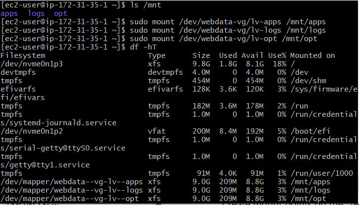

### 3. Install NFS Server

Install NFS Server, configure it to start on reboot, and ensure it's running:

```bash
sudo yum update -y
sudo yum install nfs-utils -y
sudo systemctl start nfs-server.service
sudo systemctl enable nfs-server.service
sudo systemctl status nfs-server.service
```

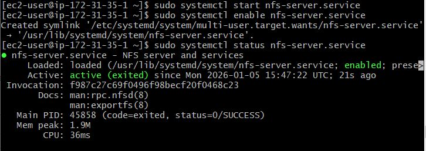

### 4. Export the Mounts for Webservers' Subnet CIDR to Connect as Clients

Set up permissions that will allow the Web Servers to read, write, and execute files on NFS:

```bash
sudo chown -R nobody: /mnt/{apps,logs,opt}
sudo chmod -R 777 /mnt/{apps,logs,opt}
sudo systemctl restart nfs-server.service
```

Configure access to NFS for clients within the same subnet (example Subnet CIDR - 172.31.32.0/20):

```bash
sudo vi /etc/exports

/mnt/apps 172.31.32.0/20(rw,sync,no_all_squash,no_root_squash)
/mnt/logs 172.31.32.0/20(rw,sync,no_all_squash,no_root_squash)
/mnt/opt 172.31.32.0/20(rw,sync,no_all_squash,no_root_squash)

sudo exportfs -arv
```

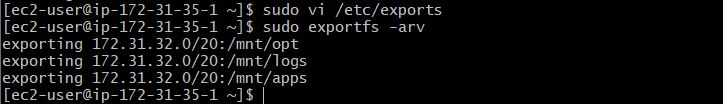

### 5. Check Which Port is Used by NFS and Open It Using Security Group

```bash
rpcinfo -p | grep nfs
```


**Note**: For NFS Server to be accessible from the client, we must open the following ports: TCP 111, UDP 111, UDP 2049, and TCP 2049. Set the Web Server subnet CIDR as the source in the security group.

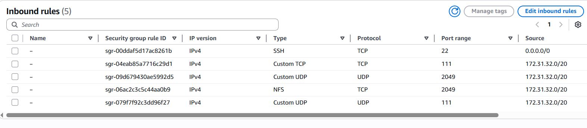

## Step 2 - Configure the Database Server

### Launch an Ubuntu EC2 Instance for DB Server


Access the instance to begin configuration:

Update and upgrade Ubuntu:  

```bash
sudo apt update && sudo apt upgrade -y
```

### 1. Install MySQL Server

Install MySQL server:

```bash
sudo apt install mysql-server -y
```


# login to the mysql console

Follow the steps to secure mysql. Create root user, then run the secure_mysql_installation.

- Login to the mysql console:

```sh
sudo mysql
```

- Create the root user with a new password:

```sh
ALTER USER 'root'@'localhost' IDENTIFIED BY 'Passw0rd123#';
```
Ideally, in a production environment use a stronger password.

Exit the mysql console:

```sh
exit
```

- Secure mysql by following the prompts:

```sh
sudo mysql_secure_installation
```

- Configure remote access. Edit the `mysqld.cnf` file, replacing the **bind-address** port on localhost `127.0.0.1` with `0.0.0.0`

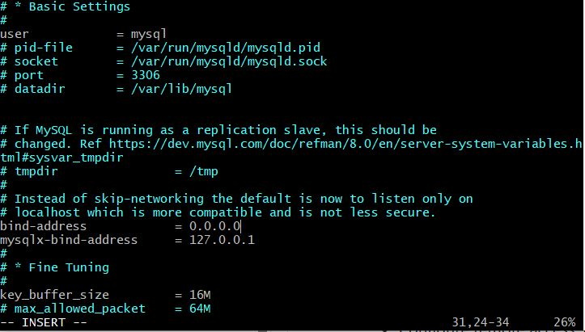

```sh
sudo vi /etc/mysql/mysql.conf.d/mysqld.cnf
skip-name-resolve
```

Restart mysql to apply changes:

```sh
sudo systemctl restart mysql
sudo systemctl status mysql
```

- Login to mysql with the root user. 

```sh
sudo mysql -u root -p
```


- Create a database and name it `tooling` with a database user named `webaccess` granted access only from the webservers subnet cidr `172.31.32.0/20`

```sql
CREATE DATABASE tooling;
CREATE USER 'webaccess'@'172.31.3%' IDENTIFIED BY 'Passw0rd123#';
CREATE USER 'webaccess'@'172.31.4%' IDENTIFIED BY 'Passw0rd123#';

GRANT ALL PRIVILEGES on tooling.* TO 'webaccess'@'172.31.3%';
GRANT ALL PRIVILEGES on tooling.* TO 'webaccess'@'172.31.4%';


FLUSH PRIVILEGES;

SHOW DATABASES;

USE tooling;

SELECT host, user from mysql.user;

exit

```

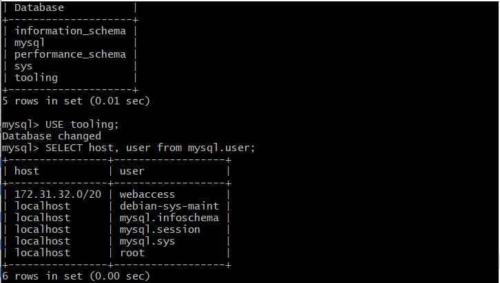

*Hint*
In a production environment with different subnets, we can use wild cards. For example:

```sql
-- Create the user with wildcard for the host
CREATE USER 'webaccess'@'172.31.%' IDENTIFIED BY 'Passw0rd321#';

-- Grant privileges to the user for the specific database
GRANT ALL PRIVILEGES ON tooling.* TO 'webaccess'@'172.31.%';

-- Optional: Flush privileges to apply changes immediately
FLUSH PRIVILEGES;

```

## Step 3 Configure the Web Servers.

Our goal is to ensure that the web servers serve the same content from the shared storage solutions i.e the NFS server and MySQL database server. The Database server can allow multiple reads and writes by multiple clients. We will use the NFS server to store shared files that the three web servers will use. 

The previously created logical volume for the web application on `lv-apps` will be mounted on the apache web files diectory on `/var/www`

This makes the web servers stateless, thereby preserving the integrity of the data in the database and on the NFS

Next, we will:
- Configure NFS client on all three web servers
- Deploy a tooling application to web servers into a shared NFS folders
- Configure the three web servers to work with a single MySQL database.


We will use RHEL Operating system 9 for our webservers.

Launch 3 RHEL webservers on AWS named `webserver01`, `webserver02`, `webserver03`. Configure the security groups to allow inbound access on ports `80` (HTTP) and `22`(SSH); 

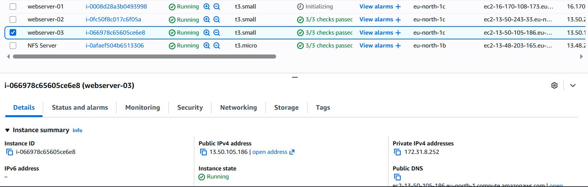


The following commands should be applied on all three servers.

- Install the NFS client :

```sh
sudo yum install nfs-utils nfs4-acl-tools -y
```

`nfs-utils` allows you to set up and manage NFS shares and clients.


`nfs4-acl-tools` package provides tools specifically for managing NFSv4 Access Control Lists (ACLs). NFSv4 supports advanced file permission settings (ACLs), and this tool allows you to manipulate and configure these permissions.

- Mount `/var/www` targeting the NFS server's export for apps
This means we will connect the local directory `/var/www` on our web server to the shared directory (or "export") for apps `/mnt/apps` on an NFS server. 

```sh
# create the mount point on the web server
sudo mkdir /var/www

# mount the directory to the target directory on the web server
sudo mount -t nfs -o rw,nosuid [NFS-Server-Private-IP-Address]:/mnt/apps /var/www
```

Replace [NFS-Server-Private-IP-Address] with your private NFS server address which in my case is : `172.31.35.1`

```sh
sudo mount -t nfs -o rw,nosuid 172.31.35.1:/mnt/apps /var/www
```
**explanation of the flags**
`-t nfs`: Specifies the file system type as NFS.
`-o rw,nosuid`:
`-o` specifies the mount options which follows thereafter.
`rw` mounts the directory with read-write permissions.
`nosuid` prevents the execution of any set-user-identifier or set-group-identifier files on this mount, adding an extra layer of security.

*Troubleshooting hint*
if the mount command is not successfull, It may mean your security groups are not properly configured, your nfs configuration file may need to be checked. Review them.

You can install the nmap tool to check connection to the port with the following command:

```sh
sudo yum install nmap-ncat -y
```
Then run: `nc -zv [private IP of nfs server] 2049` to review connection settings


- Verify that the NFS was mounted successfully by running `df -h`.

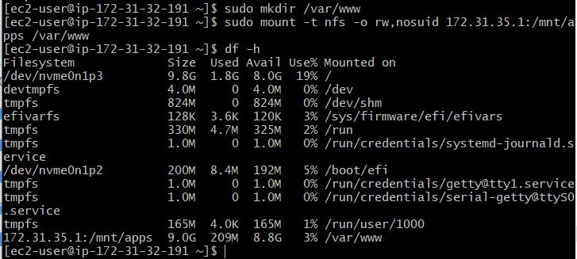
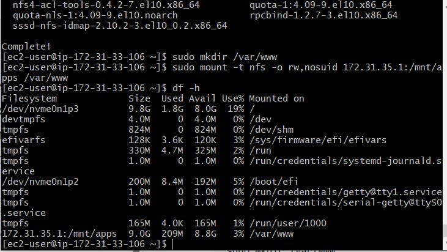)
)

- Ensure that the changes persist on the web servers after reboot by editing the `/etc/fstab` and adding the following content:

```sh
[NFS-Server-Private -IP]:/mnt/apps /var/www nfs defaults 0 0
```

```sh
172.31.35.1:/mnt/apps /var/www nfs defaults 0 0
```
- Next we will install the Remi repository (which is an open source repo that provides the latest full-featured versions of some software to fedora and enterprise linux machines), Apache and PHP.

```sh
sudo yum install httpd -y
sudo dnf install https://dl.fedoraproject.org/pub/epel/epel-release-latest-8.noarch.rpm
sudo dnf install dnf-utils https://rpms.remirepo.net/enterprise/remi-release-9.rpm
sudo dnf module reset php
sudo dnf module enable php:remi-8.1
sudo dnf install php php-opcache php-gd php-curl php-mysqlnd -y
sudo systemctl start php-fpm
sudo systemctl enable php-fpm
sudo setsebool -P httpd_execmem 1
sudo systemctl start httpd
sudo systemctl enable httpd
```
- Verify the installation of apache and php

- Verify that the Apache files and directories are available on the web servers in `/var/www` and also on the NFS server in `mnt/apps`. We will try creating a new file from one server and check if the file is accessible on another server.

Run the following command on `webserver1`. Check for the presence of the file in `webserver2` and `webserver3` respectively.
```sh
sudo touch /var/www/html/test.txt
```
Notice that the file is also present in the `/mnt/apps/html` folder in the NFS server

- We need to mount the Apache log folder to the NFS server. Typically, Apache logs are stored in `/var/log/httpd` Before we mount, it is important to backup the log files to prevent the loss of log files.

Create the folder for the backup files and use the `rsync` utility to copy the content into it as follows:

```
sudo mkdir -p /var/backups/httpd_logs
sudo rsync -av /var/log/httpd/ /var/backups/httpd_logs/
```

Then mount the NFS share:

```sh
sudo mount -t nfs -o rw,nosuid [NFS-Server-Private-IP-Address]:/mnt/logs /var/log/httpd
```
```sh
sudo mount -t nfs -o rw,nosuid 172.31.35.1:/mnt/logs /var/log/httpd
```

Also make sure the mount point persist after reboot by editing the `/etc/fstab`.

And add this line to `/etc/fstab`:

```sh
[NFS-Server-Private-IP]:/mnt/logs /var/log/httpd nfs defaults 0 0
```

```sh
172.31.35.1:/mnt/logs /var/log/httpd nfs defaults 0 0
```

Restore the backed-up log files to the mounted directory using `rsync`:
```sh
sudo rsync -av /var/backups/httpd_logs/ /var/log/httpd/
```

**Tooling Website Deployment**

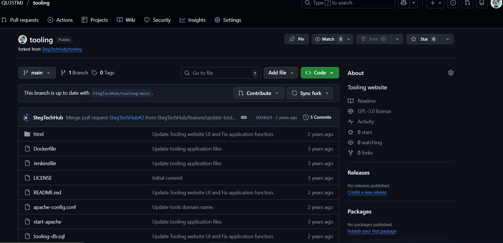

- Clone the tooling repository and move the contents of the html folder to /var/www/html:

```sh
git clone https://github.com/QU35TMJ/tooling.git
sudo cp -R tooling/html/. /var/www/html/
```
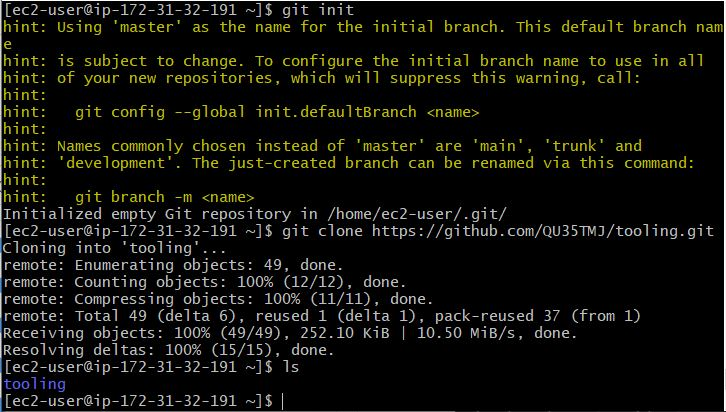


The git clone and copy command was run on only `webserver1` . The content of the `/var/www/html` is found in the remaining two servers as shown in the images below:

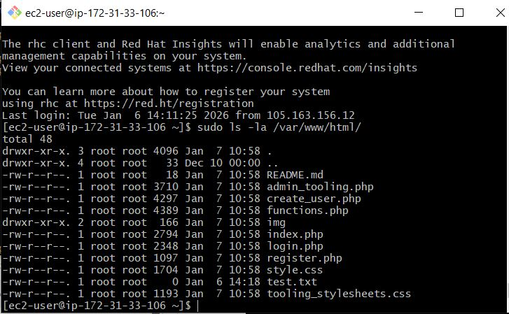


*Hint*:
You may need to install git : `sudo yum install git -y`
`tooling/html/.` copies all contents, including hidden files.
`tooling/html/*` copies all visible contents but excludes hidden files.

The tooling website code is deployed to the webservers. The html folder from the repo is deployed to `/var/www/html`

- Set appropriate permissions:
```sh
sudo chown -R apache:apache /var/www/html
sudo chmod -R 755 /var/www/html
```
This change of ownership will also be reflected in the remaining two servers.

- Set selinux policies: Important for website access 

```sh
# Change ownership
sudo chown -R apache:apache /var/www/html/

# Add SELinux context
sudo semanage fcontext -a -t httpd_sys_rw_content_t "/var/www/html(/.*)?"

# Restore SELinux contexts
sudo restorecon -R /var/www/html/

# Allow network connections:
sudo setsebool -P httpd_can_network_connect on

# Allow access to NFS mounts
sudo setsebool -P httpd_use_nfs on

# Allow access to allocated memory
sudo setsebool -P httpd_execmem on

```

- We will update the `/var/www/html/functions.php` file with the correct database connection details. You can use `sed` to replace placeholders:

```sh
$db = mysqli_connect('172.31.23.85', 'webaccess', 'Passw0rd123#', 'tooling');
```


- We will install mysql client on the webservers. Run the following commands to install mysql client on the servers. (You may need to install `wget` utility first: `sudo yum install wget -y`)

```sh
# Update repo
sudo yum update

# To install the mysql-client use:
```sh
sudo dnf install -y https://repo.mysql.com/mysql80-community-release-el9.rpm
sudo dnf install mysql-community-client -y
```

- Apply the `tooling-db.sql` script to the database by using the following command:

```sql
mysql -h [database-private-ip] -u [db-username] -p [db-name] < tooling-db.sql
```
```sql
mysql -h 172.31.23.85 -u webaccess -p tooling < tooling-db.sql
```
Enter the password for the webaccess user when prompted.

If the command runs without errors, it is successful.

- In the MySQL server we create a new admin user with username `myuser` and password `password`. 
We accessed our database from `webserver1` which has mysql-client installed. Ensure to login to the database first with the following command:

```sql
mysql -h 172.31.23.85 -u webaccess -p tooling
```
Enter the password when prompted. Then run the following mysql command to insert the new admin user into the database.

```sh
INSERT INTO `users` (`username`, `password`, `email`, `user_type`, `status`) 
VALUES ('myuser', '5f4dcc3b5aa765d61d8327deb882cf99', 'user@mail.com', 'admin', '1');
```

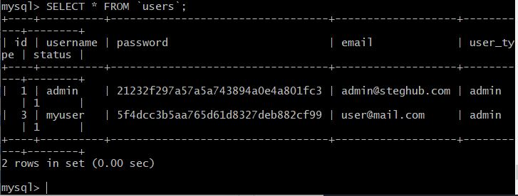


- When we open the website in our web browser at `http://[web-server-Public-IP]/index.php` , we should be able to login with the `myuser` user

```sh
http://98.81.207.96/index.php
```
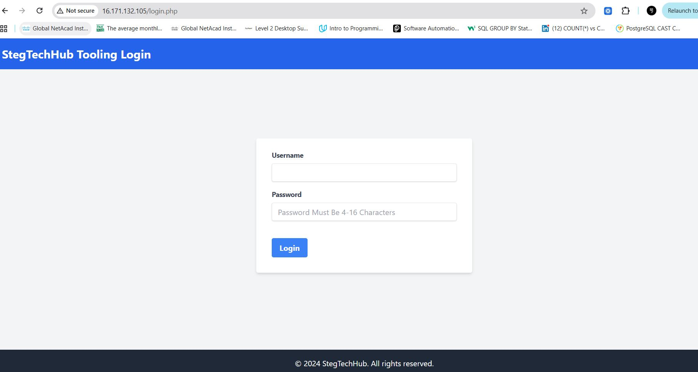

When we login to the application from `webserver1`, we see the following page:


*Hint*
If you get a 403 forbidden error:

Check:
1. `/var/www/html` folder and file permissions

2. Disable selinux policies: 

```sh
sudo vi /etc/selinux/config
```

Find the line that reads `SELINUX=enforcing` and change it to:

```sh
SELINUX=disable
```
We are able to login to the application from the remaining two `webserver1` and `webserver2` as shown:
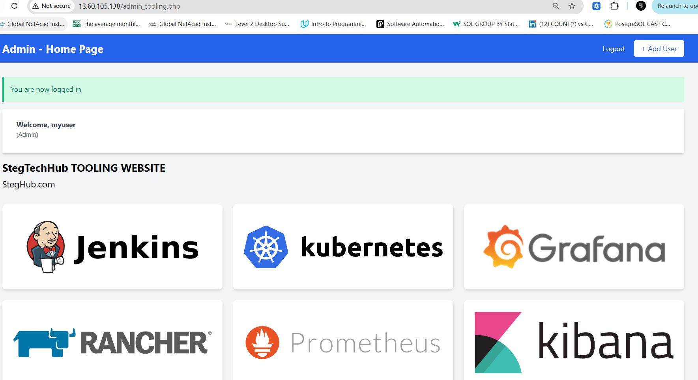


## Conclusion

We have now successfully set up a multi-tier web application architecture using:
- An NFS server for shared storage
- A MySQL database server
- Multiple web servers running Apache and PHP

This setup was done in such a way that allows/permits for a scalable and distributed web application, with shared storage for consistency across web servers and a centralized database for data management.

Some of the vital highlight from this project are:
1. Proper configuration of NFS for shared storage across multiple servers
2. Setting up and securing a MySQL database server
3. Configuring web servers with Apache and PHP to work with NFS and MySQL
4. The importance of security configurations, including firewall rules and SELinux settings

This project provides a solid foundation for hosting web applications in a scalable and maintainable infrastructure.
