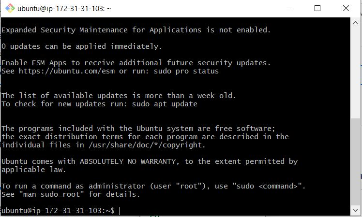
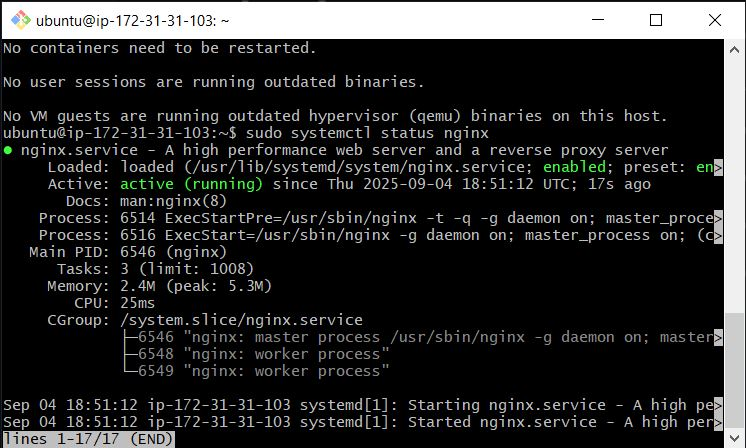
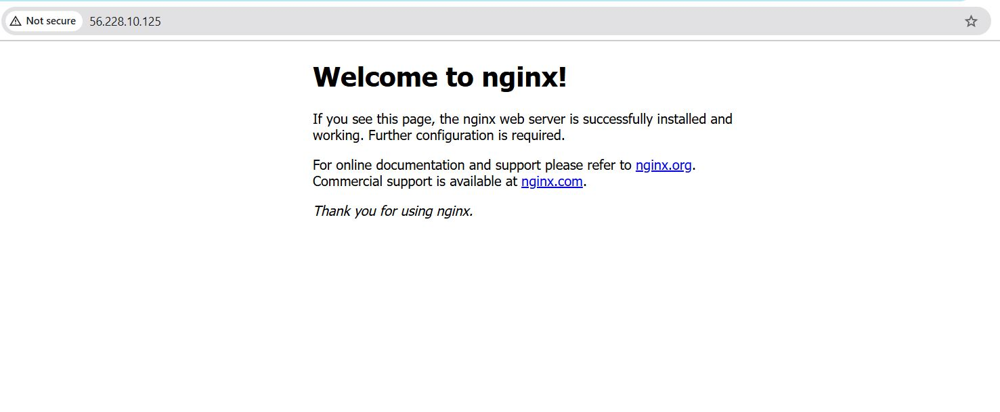
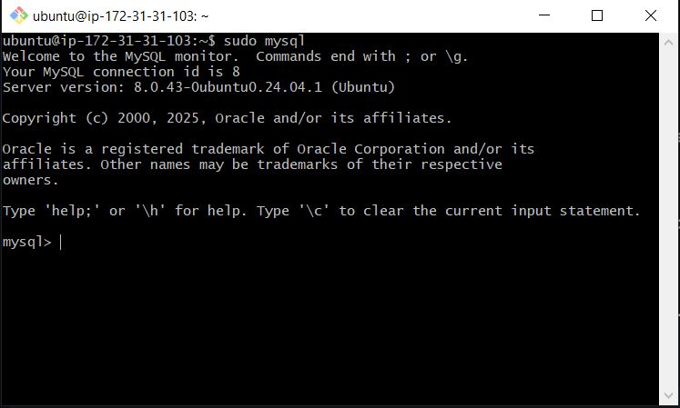
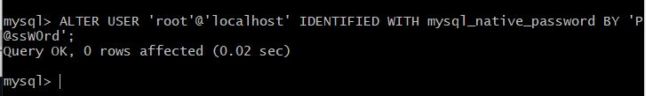
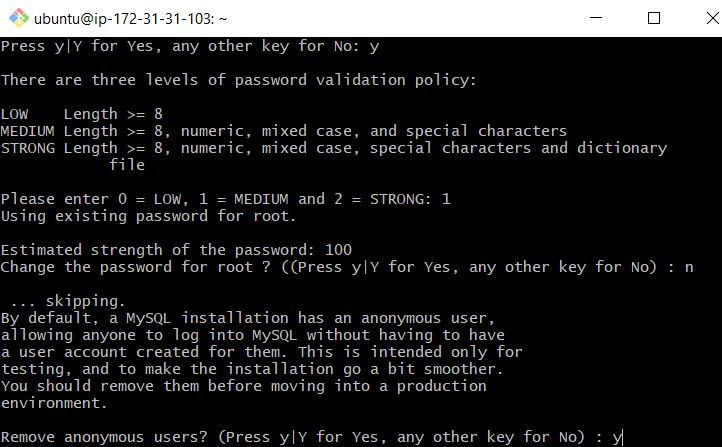
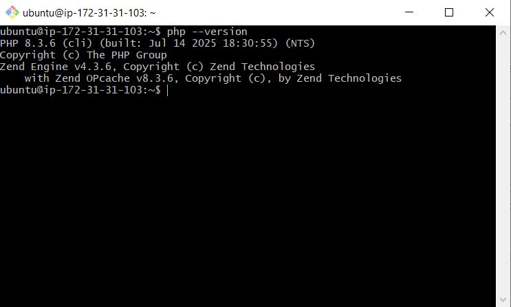
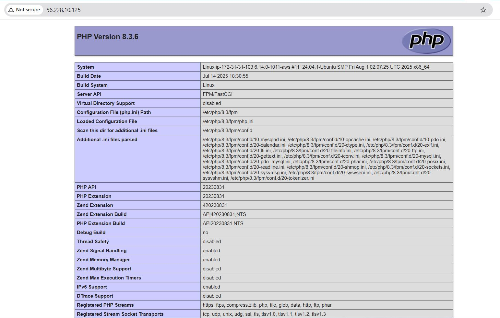
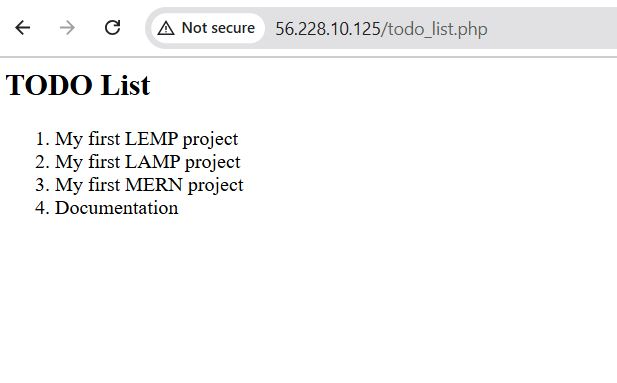

# LEMP STACK ON AWS

## Table of Content
1. [Introduction](#introduction)
2. [Deploy LEMP stack manualy on AWS](#deploy-lemp-stack-manually-on-aws)
    * [Step 0 Prepare Prerequisites](#step-0-prepare-prerequisites)
    * [Step 1 Install Nginx web server](#step-1-install-nginx-web-server)
    * [Step 2 Install MySQL](#step-2-install-mysql)
    * [Step 3 Install PHP](#step-3-install-php)
    * [Step 4 Configure Nginx to use PHP processor](#step-4-configure-nginx-to-use-php-processor)
    * [Step 5 Test server block with html](#step-5-test-server-block-with-html)
    * [Step 6 Test server block with php](#step-6-test-server-block-with-php)
    * [Step 7 Retrieve data from the MySQl database with PHP](#step-7-retrieve-data-from-the-mysql-database-with-php)
3. [Conclusion](#conclusion)

## Project Overview
The LEMP stack is a widely used software stack for serving web applications and dynamic web pages. LEMP stands for:

- Linux: The foundational operating system, known for its robustness and security.
- Engine-X (Nginx): The high-performance web server that handles incoming requests and serves static content, acting as a reverse proxy and load balancer.
- MySQL: A reliable relational database management system that stores application data in structured tables.
- PHP: A server-side scripting language used for web development, enabling dynamic content through database interactions.

**How LEMP Works**

Nginx receives HTTP requests from clients. For dynamic pages, it forwards requests to PHP, which processes them, interacts with MySQL for data retrieval or storage, and sends results back to Nginx, which then responds to the client.

## Deploy LEMP stack manully on AWS

## Step 0 Prepare Prerequisites

1. **Launch an EC2 Instance**: Start by launching a t2.micro EC2 instance (or any compute engine) running Ubuntu 24.04 LTS or later. Choose a region close to your target audience. (This guide assumes you’re using AWS, but you can adapt these steps for other cloud providers.)

   

  Ensure to Set up your instance’s security group with these inbound rules:
   - Allow HTTP traffic (port 80) from anywhere.
   - Allow HTTPS traffic (port 443) from anywhere.
   - Allow SSH traffic (port 22) from anywhere (this is usually enabled by default).

   ```
   Then connect to the instance with:
   ```bash
   ssh -i "my-ec2-key.pem" ubuntu@<instance-ip>
   ```
   

## Step 1: Install Nginx

1. **Update and Upgrade Packages**:
   ```bash
   sudo apt update
   sudo apt upgrade -y
   ```

2. **Install Nginx**:
   ```bash
   sudo apt install nginx -y
   ```

3. **Check Nginx Status**:
   ```bash
   sudo systemctl status nginx
   ```

   

4. **Test Nginx**:
   ```bash
   curl http://localhost:80
   ```

5. **Access Nginx in Your Browser**: Open your browser and navigate to:
   ```
   http://56.228.10.125
   ```
   


## Step 2: Install MySQL

1. **Install MySQL**:
   ```bash
   sudo apt install mysql-server
   ```
2. **Log into MySQL**:
   ```bash
   sudo mysql
   ```
   

3. **Set Root Password**:
   ```sql
   ALTER USER 'root'@'localhost' IDENTIFIED WITH mysql_native_password BY 'RootPass.3';
   ```

   

   Log out:
   ```sql
   EXIT;
   ```

4. **Secure MySQL**:
   ```bash
   sudo mysql_secure_installation
   ```

   

5. **Test MySQL Login**:
   ```bash
   sudo mysql -u root -p
   ```
   Exit when done:
   ```sql
   EXIT;
   ```
6. **Create a test database and a test user**
   ```bash
   CREATE DATABASE testdb;
   CREATE USER 'test'@'localhost' IDENTIFIED BY 'Test@123';
   GRANT ALL ON testdb.* TO 'test'@'localhost';
   FLUSH PLIVILEGES;
   ```
    

## Step 3: Install PHP

**Install PHP** and **Check php Version**:
   ```bash
   sudo apt install php-fpm php-mysql -y
   ```
    ```bash
   php --version
   ```
   

## Step 4: Configure Nginx for PHP

1. **Create a Web Directory**:
   ```bash
   sudo mkdir /var/www/lemp
   ```

2. **Change Ownership**:
   ```bash
   sudo chown -R $USER:$USER /var/www/lemp
   ```
3. **Create Nginx Config File**:
   ```bash
   sudo vi /etc/nginx/sites-available/lemp
   ```
   Paste the following configuration:
   ```nginx
   server {
    listen 80;
    server_name lemp www.lemp;
    root /var/www/lemp;
    index index.html index.htm index.php;

    # Access and error logs
    access_log /var/log/nginx/lemp.access.log;
    error_log /var/log/nginx/lemp.error.log;

    # Handling static files
    location / {
        try_files $uri $uri/ =404;
    }

    # PHP-FPM Configuration
    location ~ \.php$ {
        include snippets/fastcgi-php.conf;
        fastcgi_pass unix:/var/run/php/php8.3-fpm.sock;  # Update to the PHP version>
        
    }

    # Deny access to .htaccess files
    location ~ /\.ht {
        deny all;
    }
   }
   ```

4. **Activate the Configuration**:
   ```
   sudo ln -s /etc/nginx/sites-available/projectLEMP /etc/nginx/sites-enabled/
   ```

5. **Test Nginx Configuration**:
   ```bash
   sudo nginx -t
   ```
6. **Disable Default Config and Reload Nginx**:
   ```bash
   sudo unlink /etc/nginx/sites-enabled/default
   ```
   ```bash
   sudo systemctl reload nginx
   ```
   

## Step 5: Test PHP Requests

1. **Create a Sample PHP File**:
   ```bash
   sudo nano /var/www/lemp/index.php
   ```
   Add the following code:
   ```php
   <?php 
   phpinfo();
   ?>
   ```

2. **Access via Browser**:
   ```
   http://<ec2_public_ip_address>
   ```
   

## Step 6: Create and Retrieve Data from MySQL

1. **Log into MySQL Using The Existing User**:
   ```bash
   sudo mysql -u test -p
   ```

5. **Create a Table**:
   ```sql
   USE testdb;
   CREATE TABLE todo_list (
       item_id INT AUTO_INCREMENT,
       content VARCHAR(255),
       PRIMARY KEY (item_id)
   );
   ```

6. **Insert Records**:
   ```sql
   INSERT INTO testdb.todo_list (content) VALUES ("My first LEMP project");

   INSERT INTO testdb.todo_list (content) VALUES ("My first LAMP project");

   INSERT INTO testdb.todo_list (content) VALUES ("My first MERN project");

   INSERT INTO testdb.todo_list (content) VALUES ("Documentation");
   ```

7. **Verify Data**:
   ```sql
   SELECT * FROM todo_list;
   ```


   Exit MySQL:
   ```sql
   EXIT;
   ```

8. **Create a PHP Script to Retrieve Data**:
   ```bash
   sudo nano /var/www/lemp/todo_list.php
   ```

   Add this code:
   ```php
   <?php
   $user = "test";
   $password = "Test@123";
   $database = "testdb";
   $table= "todo_list";

   try {
       $db = new PDO("mysql:host=localhost;dbname=$database", $user, $password);
       echo "<h2>TODO List</h2><ol>";
       foreach ($db->query("SELECT content FROM $table") as $row) {
           echo "<li>" . $row['content'] . "</li>";
       }
       echo "</ol>";
   } catch (PDOException $e) {
       echo "Connection failed: " . $e->getMessage();
   }
   ?>
   ```

   ```
   - **The functionality of the script**

   This PHP script connects to a MySQL database, retrieves data from a "todo_list" table, and displays the tasks in an unordered list.

   - **Functionality Breakdown:**

    1. Database Configuration: The script defines database connection parameters (host, database name, username, password, and table name).

    2. Database Connection: It establishes a connection to the database using PDO (PHP Data Objects) and sets the error mode to throw exceptions.
  
    3. Query Execution: The script executes a SELECT query to retrieve all tasks from the "todo_list" table.
  
    4. Data Retrieval: It fetches all query results as an associative array.
  
    5. Displaying Results: If tasks exist, it displays them in an unordered list with task ID, description, and status. Otherwise, it shows a "No tasks found" message.

    6. Error Handling: The script catches and displays any PDO exceptions that occur during database connection or query execution.
    ```

9. **Access Your To-Do List**:
   ```
   http://56.228.10.125/todo_list.php
   ```
   

## Conclusion

Congratulations! You've successfully set up a LEMP stack on AWS. This LEMP stack (just like the LAMP stack) provides a solid platform for hosting and serving web apps. If you as a developer want to deploy scal>
