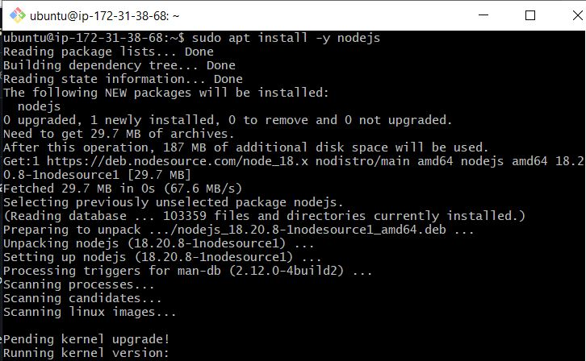
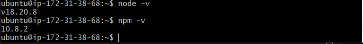
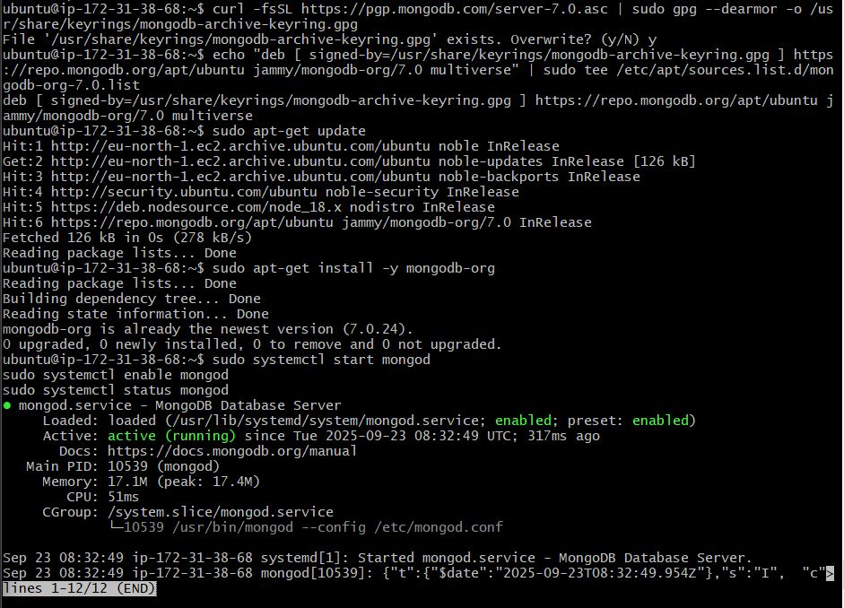
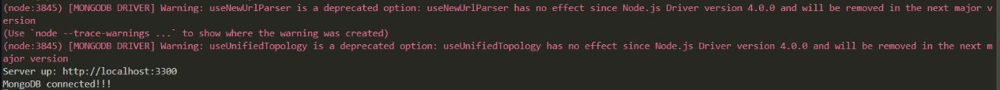
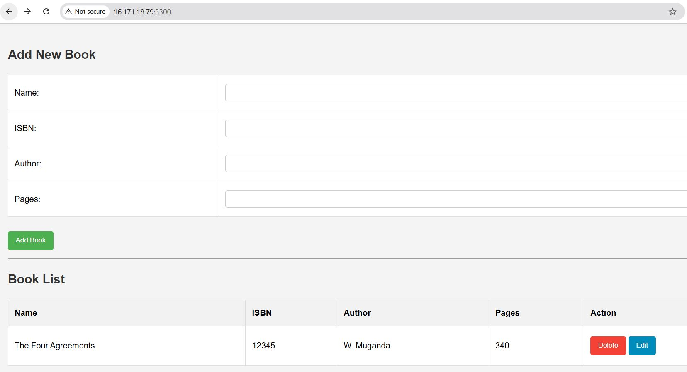

# MEAN STACK DEPLOYMENT ON AWS

## Project Overview
The MEAN stack is a powerful collection of JavaScript-based technologies used for building dynamic web applications. The acronym "MEAN" stands for its four main components: MongoDB, Express.js, Angular, and Node.js. Each of these technologies plays a critical role in the development process, allowing developers to create full-stack applications efficiently.

- MongoDB: Stores data in flexible, JSON-like documents, making it easy to handle large volumes of data

- Express.js: Web application framework for Node.js. Express acts as a bridge between the client-side and server-side, managing incoming requests and sending responses back to the client

- Angular: Angular handles the client-side logic and rendering of the application.

- Node.js: Javascript runtime Environment. Executes JavaScript code on the server-side. Node.js allows developers to use JavaScript throughout the entire stack, enabling seamless communication between the client and server.

The MEAN stack application is abook management application that adds book records to MongoDB. The records contain ISBN number, author and number of pages.


## Steps
## Step 1: Install NodeJS.

Node.js is like the center of our operation. follow the steps below to get it installed on your machine:

1. First, we'll update our cloud computer to make sure it has the latest information by running this command on our cli:

   ```bash
   sudo apt update && sudo apt upgrade -y
   ```
2. Next thing, we will add some security certificates. 
   ```bash
   sudo apt -y install curl dirmngr apt-transport-https lsb-release ca-certificates
   ```
   ```bash
   curl -sL https://deb.nodesource.com/setup_18.x | sudo -E bash -
   ```

3. Now, let us install Node.js:

   ```bash
   sudo apt-get install -y nodejs
   ```
   

The installation step installs both node.js and npm.

- Update the apt repositories:

   

```sh
sudo apt update -y
```

## Step 2: Install MongoDB and configure backend server.

```sh
# Install Dependency packages:

sudo apt install gnupg wget apt-transport-https ca-certificates software-properties-common

# Import MongoDB's GPG Key
wget -qO- https://pgp.mongodb.com/server-7.0.asc | gpg --dearmor | sudo tee /usr/share/keyrings/mongodb-server-7.0.gpg >/dev/null

# Add MongoDB's Repository
echo "deb [ arch=amd64,arm64 signed-by=/usr/share/keyrings/mongodb-server-7.0.gpg ] https://repo.mongodb.org/apt/ubuntu $(lsb_release -cs)/mongodb-org/7.0 multiverse" | sudo tee -a /etc/apt/sources.list.d/mongodb-org-7.0.list

# Update repository again
sudo apt update

# Install MongoDB
sudo apt install mongodb-org -y

```

- Start and enable mongoDB service:

```sh
sudo systemctl enable mongod

sudo systemctl status mongod
```



-Install `body-parser`
The `body-parser` package helps us to process JSON files passed in requests to the server

- Run:

```sh
npm install body-parser
```


-Create a folder named `Books` and cd into it:

```sh
mkdir Books && cd Books
```

-Initialise the npm project within the created folder:

```sh
npm init
```

- create a file named ``server.js` and enter the following code:

```js
const express = require('express');
const bodyParser = require('body-parser');
const mongoose = require('mongoose');
const path = require('path');

const app = express();

const PORT = process.env.PORT || 3300;

// Connect to the Database
mongoose.connect('mongodb://localhost:27017/test', {
  useNewUrlParser: true,
  useUnifiedTopology: true
})
  .then(() => console.log('MongoDB connected!!!'))
  .catch(err => console.log('MongoDB connection error:', err));

app.use(express.static(path.join(__dirname, 'public')));
app.use(bodyParser.json());

require('./apps/routes')(app);

app.listen(PORT, () => {
  console.log(`Server up: http://localhost:${PORT}`);
});
```

**Explanation of the code functionality**:

This code sets up a basic Express.js server that connects to a MongoDB database using Mongoose. It requires necessary modules, configures the server to serve static files and parse JSON requests, and establishes a database connection. 

The server listens on port `3300` (or a specified environment variable) and logs a success message upon startup. Additionally, it requires a separate route configuration file (./apps/routes) to define API endpoints.


Note that we need to open the security group ports on `3300` and `27017`

## Step 4: Install Express and set up routes to the server.

We will use express to pass book information to and from the MongoDB database. Mongoose will be used to establish a schema for the database to store data of the book register.

```sh
npm install express mongoose
```

- Within the `Books` folder, we will create a folder named `apps` and cd into it.

```sh 
mkdir apps && cd apps
```
- We will create the routes file named `routes.js` and add the following code.

```sh
vi routes.js
```

```js
const Book = require('./models/book');
const path = require('path');

// Export the Router
module.exports = function(app) {
  // GET route to fetch all books
  app.get('/book', async (req, res) => {
    try {
      // Retrieve all books from the database
      const books = await Book.find();
      // Send the books as a JSON response
      res.json(books);
    } catch (err) {
      // If an error occurs, send a 500 status with an error message
      res.status(500).json({ message: 'Error fetching books', error: err.message });
    }
  });

  // POST route to add a new book
  app.post('/book', async (req, res) => {
    try {
      // Create a new Book instance with data from the request body
      const book = new Book({
        name: req.body.name,
        isbn: req.body.isbn,
        author: req.body.author,
        pages: req.body.pages
      });
      // Save the new book to the database
      const savedBook = await book.save();
      // Send a 201 status with a success message and the saved book data
      res.status(201).json({
        message: 'Successfully added book',
        book: savedBook
      });
    } catch (err) {
      // If an error occurs, send a 400 status with an error message
      res.status(400).json({ message: 'Error adding book', error: err.message });
    }
  });


   // PUT route to update a book
  app.put('/book/:isbn', async (req, res) => {
    try {
      // Find the book by ISBN and update it
      const updatedBook = await Book.findOneAndUpdate(
        { isbn: req.params.isbn },
        {
          name: req.body.name,
          author: req.body.author,
          pages: req.body.pages
        },
        { new: true, runValidators: true }
      );

      if (!updatedBook) {
        return res.status(404).json({ message: 'Book not found' });
      }

      res.json({
        message: 'Successfully updated the book',
        book: updatedBook
      });
    } catch (err) {
      res.status(500).json({ message: 'Error updating book', error: err.message });
    }
  });

  // DELETE route to remove a book by ISBN
  app.delete('/book/:isbn', async (req, res) => {
    try {
      // Find and delete the book with the specified ISBN
      const result = await Book.findOneAndDelete({ isbn: req.params.isbn });
      if (!result) {
        // If no book is found, send a 404 status
        return res.status(404).json({ message: 'Book not found' });
      }
      // If the book is successfully deleted, send a success message with the deleted book data
      res.json({
        message: 'Successfully deleted the book',
        book: result
      });
    } catch (err) {
      // If an error occurs, send a 500 status with an error message
      res.status(500).json({ message: 'Error deleting book', error: err.message });
    }
  });

  // Catch-all route to serve the main HTML file
  app.get('*', (req, res) => {
    // Send the index.html file for any unmatched routes
    res.sendFile(path.join(__dirname, '../public', 'index.html'));
  });
};

```
**Explanation of the code functionality**:

The code defines a RESTful API using Express.js to manage books in a MongoDB database. It configures routes for CRUD (Create, Read, Update, Delete) operations: retrieving all books (`GET /book`), creating a new book (`POST /book`), updating a book by ISBN (`PUT /book/:isbn`), and deleting a book by ISBN (`DELETE /book/:isbn`). The API handles errors, returning JSON responses with error messages and status codes. Additionally, it serves an `index.html` file from the public directory for any unmatched routes.


In the `apps` folder, we will create another folder called `models` and cd into it:

```sh
mkdir models && cd models
``` 

We will create a file named `book.js`

```sh
vi book.js
```

Write in the following code:

```js
const mongoose = require('mongoose');

// Define the schema for the Book model
const bookSchema = new mongoose.Schema({
  name: { 
    type: String, 
    required: true 
  },
  isbn: { 
    type: String, 
    required: true, 
    unique: true, 
    index: true  // Indexing isbn for faster queries
  },
  author: { 
    type: String, 
    required: true 
  },
  pages: { 
    type: Number, 
    required: true, 
    min: 1  // Ensure the book has at least one page
  }
}, {
  timestamps: true  // Automatically add createdAt and updatedAt fields
});

// Create and export the Book model
module.exports = mongoose.model('Book', bookSchema);
```

**Explanation of the code functionality**:

The code defines a Mongoose model for a "Book" document in a MongoDB database, specifying a schema with required fields: `name`, `isbn` (unique and indexed), `author`, and `pages` (with a minimum value of 1). The schema also automatically adds `createdAt` and `updatedAt` timestamps. 

## Step 5: Access the route with AngularJS

We will change the directory back to `Books` and create a folder named `public`. AngularJS is used to connect to the webpage with Express and perform actions on the book register.

- Change the directory:

```sh
cd ../..
mkdir public && cd public
```
- Create a file name `script.js` and add the following code:

```sh
vi script.js
```

```js
// Create an AngularJS module named 'myApp'
var app = angular.module('myApp', []);

// Define the main controller 'myCtrl'
app.controller('myCtrl', function($scope, $http) {
  // Function to get all books from the server
  function getAllBooks() {
    $http({
      method: 'GET',
      url: '/book'
    }).then(function successCallback(response) {
      $scope.books = response.data;
    }, function errorCallback(response) {
      console.log('Error: ' + response.data);
    });
  }

  // Initial load of books when the controller is initialized
  getAllBooks();

  // Function to add a new book
  $scope.add_book = function() {
    var body = {
      name: $scope.Name,
      isbn: $scope.Isbn,
      author: $scope.Author,
      pages: $scope.Pages
    };

    $http({
      method: 'POST',
      url: '/book',
      data: body
    }).then(function successCallback(response) {
      console.log(response.data);
      getAllBooks();  // Refresh the book list
      // Clear the input fields
      $scope.Name = '';
      $scope.Isbn = '';
      $scope.Author = '';
      $scope.Pages = '';
    }, function errorCallback(response) {
      console.log('Error: ' + response.data);
    });
  };

  // Function to update an existing book
  $scope.update_book = function(book) {
    var body = {
      name: book.name,
      isbn: book.isbn,
      author: book.author,
      pages: book.pages
    };

    $http({
      method: 'PUT',
      url: '/book/' + book.isbn,
      data: body
    }).then(function successCallback(response) {
      console.log(response.data);
      getAllBooks();  // Refresh the book list
    }, function errorCallback(response) {
      console.log('Error: ' + response.data);
    });
  };

  // Function to delete a book
  $scope.delete_book = function(isbn) {
    $http({
      method: 'DELETE',
      url: '/book/' + isbn
    }).then(function successCallback(response) {
      console.log(response.data);
      getAllBooks();  // Refresh the book list
    }, function errorCallback(response) {
      console.log('Error: ' + response.data);
    });
  };
});
```

**Explanation of the code functionality**:

The code defines an AngularJS application named 'myApp' and a controller named 'myCtrl'.
The controller manages CRUD (Create, Read, Update, Delete) operations for books using $http service to communicate with a backend API.


`getAllBooks() function`:

Fetches all books from the server using a GET request.
Updates the $scope.books with the received data.

`add_book() function`:

Sends a POST request to add a new book using data from input fields.
After successful addition, it refreshes the book list and clears input fields.

`update_book() function`:

Sends a PUT request to update an existing book.
After successful update, it refreshes the book list.

`delete_book() function`:

Sends a DELETE request to remove a book by its ISBN.
After successful deletion, it refreshes the book list.


- Within the `public` folder create the file named `index.html` and `styles.css`

```sh
vi index.html`
```

Paste the following code:

```sh
<!DOCTYPE html>
<html ng-app="myApp" ng-controller="myCtrl">
<head>
  <meta charset="UTF-8">
  <meta name="viewport" content="width=device-width, initial-scale=1.0">
  <title>Book Management App</title>
  <link rel="stylesheet" href="styles.css">
</head>
<body>
  <!-- Book Input Form -->
  <div>
    <h2>Add New Book</h2>
    <table>
      <tr>
        <td>Name:</td>
        <td><input type="text" ng-model="Name"></td>
      </tr>
      <tr>
        <td>ISBN:</td>
        <td><input type="text" ng-model="Isbn"></td>
      </tr>
      <tr>
        <td>Author:</td>
        <td><input type="text" ng-model="Author"></td>
      </tr>
      <tr>
        <td>Pages:</td>
        <td><input type="number" ng-model="Pages"></td>
      </tr>
    </table>
    <button ng-click="add_book()">Add Book</button>
    <div ng-if="successMessage" class="message success">{{ successMessage }}</div>
    <div ng-if="errorMessage" class="message error">{{ errorMessage }}</div>
  </div>

  <hr>

  <!-- Book List Table -->
  <div>
    <h2>Book List</h2>
    <table>
      <thead>
        <tr>
          <th>Name</th>
          <th>ISBN</th>
          <th>Author</th>
          <th>Pages</th>
          <th>Action</th>
        </tr>
      </thead>
      <tbody>
        <tr ng-repeat="book in books">
          <td>{{ book.name }}</td>
          <td>{{ book.isbn }}</td>
          <td>{{ book.author }}</td>
          <td>{{ book.pages }}</td>
          <td>
            <button class="delete" ng-click="delete_book(book.isbn)">Delete</button>
            <button class="edit" ng-click="update_book(book)">Edit</button>
          </td>
        </tr>
      </tbody>
    </table>
  </div>

  <!-- Scripts -->
  <script src="https://ajax.googleapis.com/ajax/libs/angularjs/1.6.4/angular.min.js"></script>
  <script src="script.js"></script>
</body>
</html>


```

Add the following into the `styles.css` folder

```
/* General Styles */
body {
    font-family: Arial, sans-serif;
    line-height: 1.6;
    margin: 0;
    padding: 20px;
    background-color: #f4f4f4;
}

h2 {
    color: #333;
}

/* Table Styles */
table {
    border-collapse: collapse;
    width: 100%;
    margin-bottom: 20px;
    background-color: #fff;
}

th, td {
    border: 1px solid #ddd;
    padding: 12px;
    text-align: left;
}

th {
    background-color: #f2f2f2;
    font-weight: bold;
}

/* Form Styles */
input[type="text"], input[type="number"] {
    width: 100%;
    padding: 8px;
    margin: 5px 0;
    display: inline-block;
    border: 1px solid #ccc;
    border-radius: 4px;
    box-sizing: border-box;
}

/* Button Styles */
button {
    background-color: #4CAF50;
    color: white;
    padding: 10px 15px;
    margin: 8px 0;
    border: none;
    border-radius: 4px;
    cursor: pointer;
}

button:hover {
    background-color: #45a049;
}

button.delete {
    background-color: #f44336;
}

button.delete:hover {
    background-color: #d32f2f;
}

button.edit {
    background-color: #008CBA;
}

button.edit:hover {
    background-color: #007399;
}

/* Message Styles */
.message {
    padding: 10px;
    margin: 10px 0;
    border-radius: 4px;
}

.success {
    background-color: #dff0d8;
    border: 1px solid #d6e9c6;
    color: #3c763d;
}

.error {
    background-color: #f2dede;
    border: 1px solid #ebccd1;
    color: #a94442;
}
```

- Change the directory back to `Books` and start the server


```sh
node server.js
```



We can now access the Book Register via its public IP.




## Conclusion
We have successfully created and deployed a MERN stack (a functional Book Management Application) on AWS. The application allows users to perform CRUD (Create, Read, Update, Delete) operations on a book database. 


